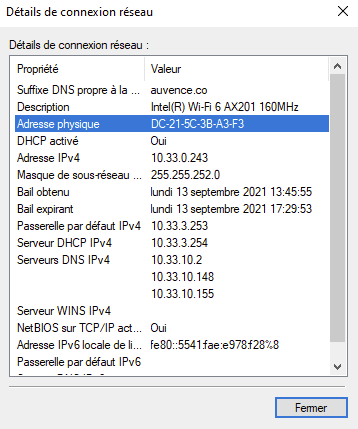
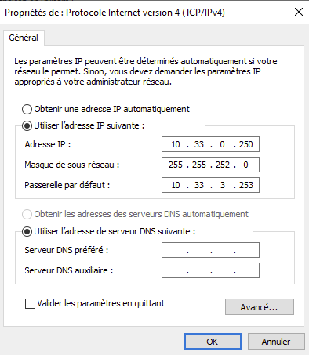
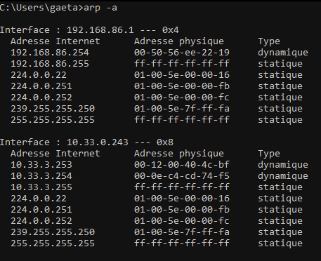
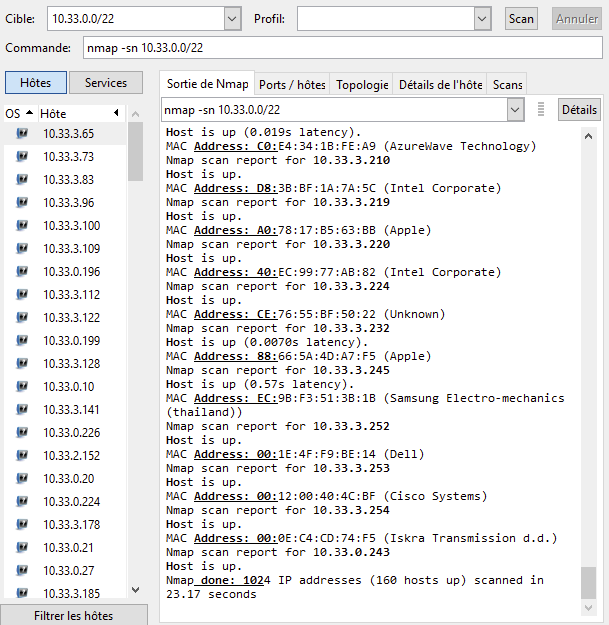
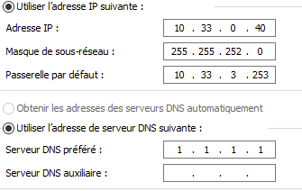
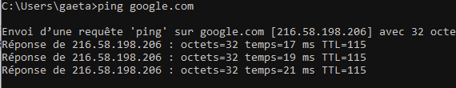
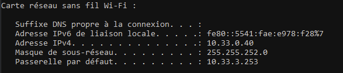
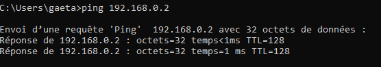
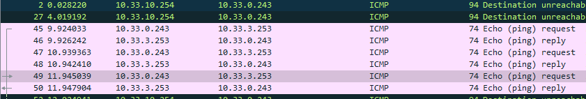

# B2_tp1_réseau

# I. Exploration locale en solo


- **Affichez les infos des cartes réseau de votre PC**

    
    ``ipconfig -all``
    
```
    Adresse physique . . . . . . . . . . . : DC-21-5C-3B-A3-F3
    Adresse IPv4. . . . . . . . . . . . . .: 10.33.0.243
```

- **nom, adresse MAC et adresse IP de l'interface Ethernet**
     `J'ai pas de port Ethernet`
     
     
- **Affichez votre gateway:**
    
    ``ipconfig``
    
`    Passerelle par défaut. . . . . . . . . : 10.33.3.253`
    

-     **🌞 Trouvez comment afficher les informations sur une carte IP (change selon l'OS)**





- **Questions
    🌞 à quoi sert la gateway dans le réseau d'YNOV ?**
    
    ```La gateway d'ynov permet de pouvoir relier des réseaux entre eux.```
    
- **2. Modifications des informations
    A. Modification d'adresse IP (part 1)**
    
    
    

    
    
    Il est possible que vous perdiez l'accès internet.
    `On pert l'accès internet car on doit surement prendre une IP de quelqu'un d'autre, ça crée donc un conflie d'adresse IP.`
    
**B. Table ARP**
- **🌞 Exploration de la table ARP**





    L'adresse MAC de la passerelle de mon réseau est `10.33.3.253           00-12-00-40-4c-bf` on la repère facilement car c'est elle qui apparait en "tête de liste" est elle a un type dynamique.
    
- **🌞 Et si on remplissait un peu la table ?**

```
    @ mac ping 1 : 10.33.0.20            74-29-af-33-1b-69
    @ mac ping 2 : 10.33.0.21            b0-fc-36-ce-9c-89
```

- **C. nmap**
- **🌞Utilisez nmap pour scanner le réseau de votre carte WiFi et trouver une adresse IP libre**





- **La table arp**

```
 10.33.0.20            74-29-af-33-1b-69     dynamique
  10.33.0.27            a8-64-f1-8b-1d-4d     dynamique
  10.33.0.210           70-66-55-47-54-15     dynamique
  10.33.1.8             0c-dd-24-aa-e1-87     dynamique
  10.33.3.13            26-7b-3f-46-6d-9e     dynamique
  10.33.3.15            26-09-60-6e-98-26     dynamique
  10.33.3.23            7e-7e-4e-bb-23-88     dynamique
  10.33.3.41            3c-58-c2-14-aa-5a     dynamique
  10.33.3.65            48-e7-da-69-32-77     dynamique
  10.33.3.168           12-88-c1-71-b7-a0     dynamique
  10.33.3.207           c0-e4-34-1b-fe-a9     dynamique
  10.33.3.253           00-12-00-40-4c-bf     dynamique
  224.0.0.22            01-00-5e-00-00-16     statique
  ...
```
  
-  **D. Modification d'adresse IP (part 2)**











- **🌞Si vos PCs ont un port RJ45 alors y'a une carte réseau Ethernet associée :**

```
ping 192.168.0.5

Envoi d’une requête 'Ping'  192.168.0.5 avec 32 octets de données :
Réponse de 192.168.0.5 : octets=32 temps<1ms TTL=128
Réponse de 192.168.0.5 : octets=32 temps=1 ms TTL=128
Réponse de 192.168.0.5 : octets=32 temps=1 ms TTL=128
```


-  **🌞 pour tester la connectivité à internet on fait souvent des requêtes simples vers un serveur internet connu**
```
ping 1.1.1.1

Envoi d’une requête 'Ping'  1.1.1.1 avec 32 octets de données :
Réponse de 1.1.1.1 : octets=32 temps=18 ms TTL=57
Réponse de 1.1.1.1 : octets=32 temps=20 ms TTL=57
Réponse de 1.1.1.1 : octets=32 temps=19 ms TTL=57
```


- **🌞 utiliser un traceroute ou tracert pour bien voir que les requêtes passent par la passerelle choisie (l'autre le PC)**
```
tracert 192.168.0.5

Détermination de l’itinéraire vers DESKTOP-DM8M0FQ [192.168.0.5]
avec un maximum de 30 sauts :

  1    <1 ms    <1 ms    <1 ms  DESKTOP-DM8M0FQ [192.168.0.5]

Itinéraire déterminé.
```

- **5. Petit chat privé**

- **🌞 sur le PC serveur**

```
sur le pc serveur : 
nc.exe -l -p 8888
```

- **🌞 sur le PC client**

```
sur le pc client : 
nc.exe IP 8888
```

- **🌞 pour aller un peu plus loin**

```Pas de port ethernet, ni mon groupe..```


- **6. Firewall**

- **🌞 Autoriser les ping**




```
PS C:\WINDOWS\system32> ping 192.168.40.3

Envoi d’une requête 'Ping'  192.168.40.3 avec 32 octets de données :
Réponse de 192.168.40.3 : octets=32 temps=41 ms TTL=64
Réponse de 192.168.40.3 : octets=32 temps=30 ms TTL=64
Réponse de 192.168.40.3 : octets=32 temps=745 ms TTL=64
Réponse de 192.168.40.3 : octets=32 temps=68 ms TTL=64

Statistiques Ping pour 192.168.43.88:
    Paquets : envoyés = 4, reçus = 4, perdus = 0 (perte 0%),
Durée approximative des boucles en millisecondes :
    Minimum = 30ms, Maximum = 745ms, Moyenne = 221ms
```


- **🌞 Autoriser le traffic sur le port qu'utilise nc**

```
PS C:\Users\gaeta\Downloads\netcat-win32-1.11\netcat-1.11> .\nc.exe -l -p 9718
salut
paul
```

- **III. Manipulations d'autres outils/protocoles côté client**

- **🌞Exploration du DHCP, depuis votre PC**

```
   Bail obtenu. . . . . . . . . . . . . . : jeudi 16 septembre 2021 17:23:06
   Bail expirant. . . . . . . . . . . . . : jeudi 16 septembre 2021 19:23:07
   Passerelle par défaut. . . . . . . . . : 10.33.3.253
   Serveur DHCP . . . . . . . . . . . . . : 10.33.3.254
```

- **2. DNS**

- **🌞 trouver l'adresse IP du serveur DNS que connaît votre ordinateur**

```
   Serveurs DNS. . .  . . . . . . . . . . : 10.33.10.2
                                       10.33.10.148
                                       10.33.10.155
```

- **🌞 utiliser, en ligne de commande l'outil nslookup (Windows, MacOS) ou dig (GNU/Linux, MacOS) pour faire des requêtes DNS à la main**

```
nslookup
Serveur par dÚfaut :   UnKnown
Address:  10.33.10.2
```
```
nslookup google.com
Serveur :   UnKnown
Address:  10.33.10.2

Réponse ne faisant pas autorité :
Nom :    google.com
Addresses:  2a00:1450:4007:817::200e
          216.58.214.78
```
```
nslookup ynov.com
Serveur :   UnKnown
Address:  10.33.10.2

Réponse ne faisant pas autorité :
Nom :    ynov.com
Address:  92.243.16.143
```
```
nslookup 78.74.21.21
Serveur :   UnKnown
Address:  10.33.10.2

Nom :    host-78-74-21-21.homerun.telia.com
Address:  78.74.21.21
```
```
nslookup 92.146.54.88
Serveur :   UnKnown
Address:  10.33.10.2

Nom :    apoitiers-654-1-167-88.w92-146.abo.wanadoo.fr
Address:  92.146.54.88
```

- **IV. Wireshark**

- **🌞 utilisez le pour observer les trames qui circulent entre vos deux carte Ethernet. Mettez en évidence**




